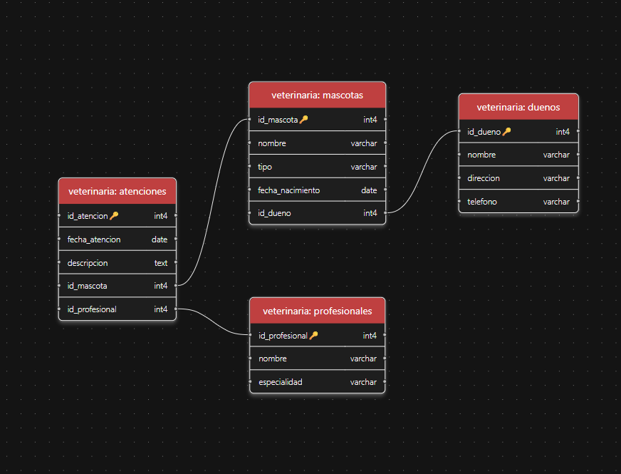

# 🐾 Sistema de Gestión - Clínica Veterinaria

Este proyecto consiste en el diseño, implementación y consulta de una base de datos relacional para una clínica veterinaria, desarrollada como **Evaluación Final del Módulo 3** en **Kibernum IT Academy**.

## 🚀 Tecnologías Utilizadas
*   **Motor de Base de Datos:** PostgreSQL 16+
*   **Lenguaje:** SQL (PostgreSQL Dialect)
*   **Conceptos Aplicados:** DDl, DML, Joins, Agregaciones, Transacciones (ACID) y Manejo de Errores.

## 🛠️ Estructura del Proyecto
La base de datos se organiza bajo el esquema `veterinaria` para separar la lógica de negocio de la administrativa, mejorando la seguridad y el orden.

### Modelo de Datos (Tablas)
1.  **`duenos`**: Almacena información de contacto de los propietarios.
2.  **`mascotas`**: Registra los pacientes, vinculados a un dueño (`FK`).
3.  **`profesionales`**: Datos de los veterinarios y sus especialidades.
4.  **`atenciones`**: Tabla transaccional que registra las visitas médicas, vinculando mascotas y profesionales.

## 📊 Funcionalidades Implementadas
El script incluye soluciones para:
*   **Integridad Referencial:** Uso de `GENERATED ALWAYS AS IDENTITY` y restricciones de llave foránea.
*   **Consultas Complejas:** Reportes detallados uniendo múltiples tablas (`JOIN`).
*   **Estadísticas:** Conteo de atenciones por profesional con agrupamiento (`GROUP BY`).
*   **Gestión de Datos:** Actualizaciones (`UPDATE`) y eliminaciones (`DELETE`) controladas.

## 💎 Características Avanzadas
Para garantizar la **consistencia de los datos**, el proyecto incluye dos enfoques de transacciones:
1.  **CTE (Common Table Expressions):** Uso de `WITH` para inserciones encadenadas capturando IDs en tiempo real.
2.  **Bloques PL/pgSQL:** Implementación de bloques `DO $$` con manejo de excepciones (`EXCEPTION WHEN OTHERS`) para asegurar que los procesos sean atómicos y seguros (Rollback automático en caso de error).

## ⚙️ Instrucciones de Ejecución
1. Crear la base de datos: `CREATE DATABASE clinica_veterinaria;`
2. Conectarse a la base de datos.
3. Ejecutar el script `script.sql` proporcionado en este repositorio.

## 📊 Schema Base de Datos

---
**Desarrollado por:** Alfonso Basterrechea  
**Fecha:** 12 Marzo 2025
